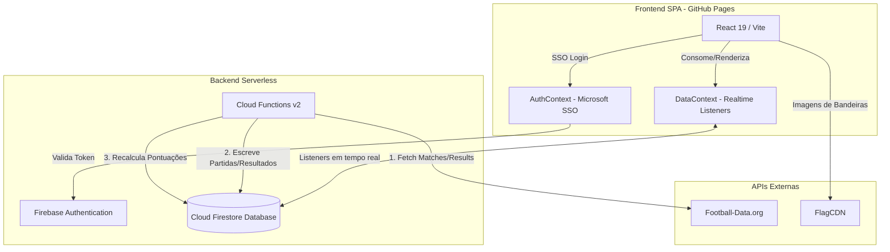

# Arquitetura do Projeto

O sistema é estruturado como uma Single Page Application (SPA) que se conecta diretamente a serviços do Firebase para persistência de dados e autenticação, com processos em segundo plano automatizados por Cloud Functions.

## Diagrama de Arquitetura



## Estrutura de Diretórios do Frontend

```
/src
  ├── main.tsx             # Ponto de entrada do React
  ├── App.tsx              # Componente raiz e roteador das abas
  ├── index.css            # Estilização vanilla centralizada
  ├── i18n.ts              # Configuração de tradução (i18next)
  ├── i18n-dictionary.ts   # Chaves de tradução (PT/EN/ES)
  ├── components/          # Componentes das abas
  │     ├── Header.tsx       # Cabeçalho unificado e resumo do usuário
  │     ├── MatchesTab.tsx   # Visualização e inserção de palpites
  │     ├── LeaderboardTab.tsx # Rankings individuais e por unidades
  │     ├── HistoryTab.tsx   # Consulta de palpites históricos de terceiros
  │     ├── AccountTab.tsx   # Perfil e seleção de unidade corporativa
  │     ├── AdminTab.tsx     # Painel de controle do administrador
  │     └── FaqTab.tsx       # Dúvidas e regras
  ├── contexts/            # Provedores de estado global
  │     ├── AuthContext.tsx  # Estado de login e privilégios
  │     ├── DataContext.tsx  # Listeners em tempo real do Firestore
  │     └── ModalContext.tsx # Controle de modais globais
```

## Modelo de Dados (Firestore)

A modelagem de dados NoSQL é organizada nas seguintes coleções principais:
- **/users/{uid}**: Cadastro de participantes com `name`, `email`, `emoji`, `unit` e total acumulado de pontos `pts`.
  - **/users/{uid}/predictions/{matchId}**: Subcoleção contendo palpites individuais dos jogos (`home` e `away`).
- **/matches/{matchId}**: Cadastro de partidas contendo equipes (`h`, `a`), kickoff (`ko`), grupo (`g`), rodada (`rod`) e flag de teste (`test`).
- **/results/{matchId}**: Placar oficial das partidas (`home`, `away`), status de ao vivo (`live`) e data de atualização.
- **/businessUnits/{unitId}**: Cadastro das unidades do DB1 Group com campos agregados (`totalPts`, `memberCount`) para cálculo de médias no ranking de equipes.
- **/admins/{email}**: Lista de e-mails de administradores dinâmicos autorizados.
- **/torneio/matamata**: Documento único consolidando chaves e resultados das fases de mata-mata.
